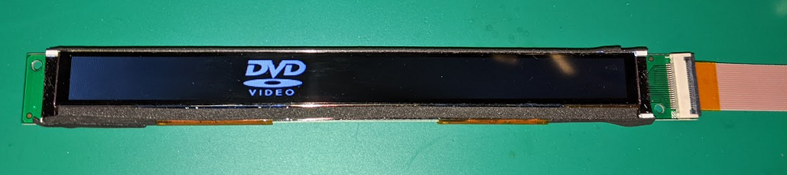

# Iris_LCD sample for STM32

## 概要

おもちゃ「マジョカアイリス」に使用されている横長LCDを動かすためのソフトウェアです。
STM32F746(Nucleo-F746ZG)で動作確認済みです。STM32CubeIDE1.5.1で作成。

※こちらの[Wiki](https://github.com/htlabnet/inside_magimajopures/wiki)に詳しい情報があります。

## 接続

ポーティングは[Iris_if_conf.h](./STM32_proj/Core/Inc/Iris_if_conf.h)で行います。

|  LCDコネクタ  |  Nucleo-144  |  備考  |
| ---- | ---- | ---- |
|  P1  |  GND  |
|  P2  |  PF0  | RST |
|  P3  |  GND  |
|  P4  |  PE0  | D0 |
|  P5  |  PE1  | D1 |
|  P6  |  PE2  | D2 |
|  P7  |  PE3  | D3 |
|  P8  |  PE4  | D4 |
|  P9  |  PE5  | D5 |
|  P10  |  PE6  | D6 |
|  P11  |  PE7  | D7 |
|  P12  |  GND  |
|  P13  |  PF1  | RDX |
|  P14  |  PF2  | WRX |
|  P15  |  PF3  | CSX |
|  P16  |  PF4  | DCX |
|  P17  |  GND  |
|  P18  |  VDD | 3.3V |
|  P19  |  VDD  | 3.3V |
|  P20  |  LED+  | 12V※ |
|  P21  |  LED-  |
|  P22  |  GND  |
※+12V直接印加OK。抵抗等は不要。

## 謝辞

LCDの初期化コードは、[こちら(kingyoPiyo氏)](https://github.com/kingyoPiyo/TFT_Test_48x640/blob/main/TFT_Test/TFT_Test.ino)を参考にさせていただきました。
